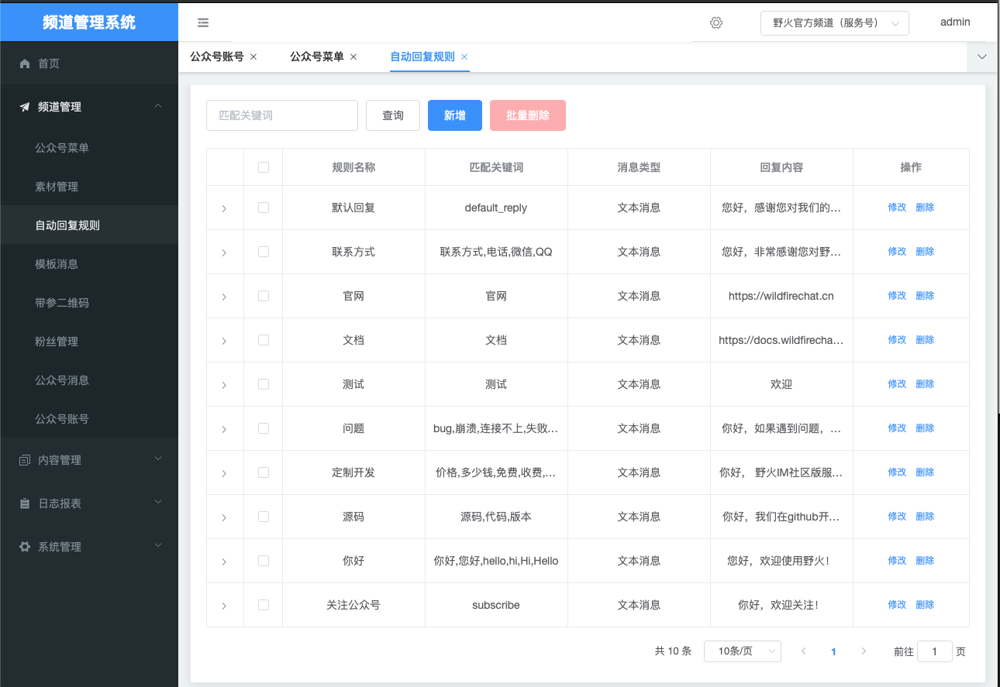
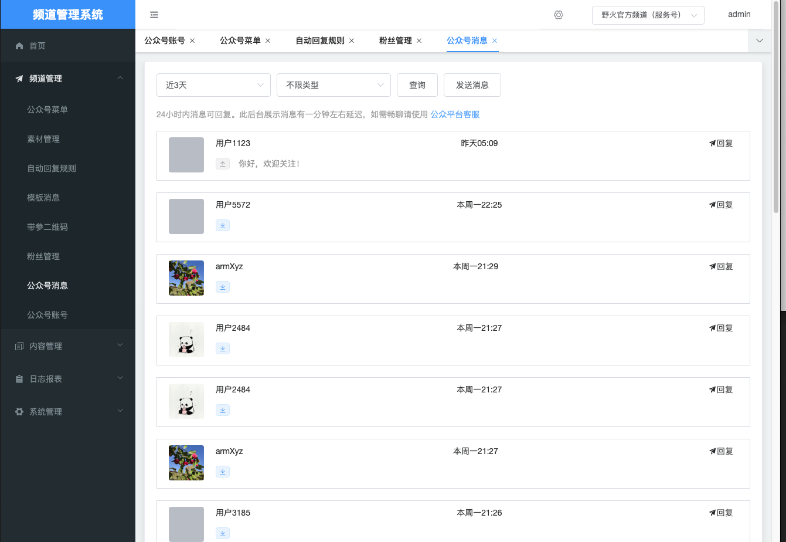
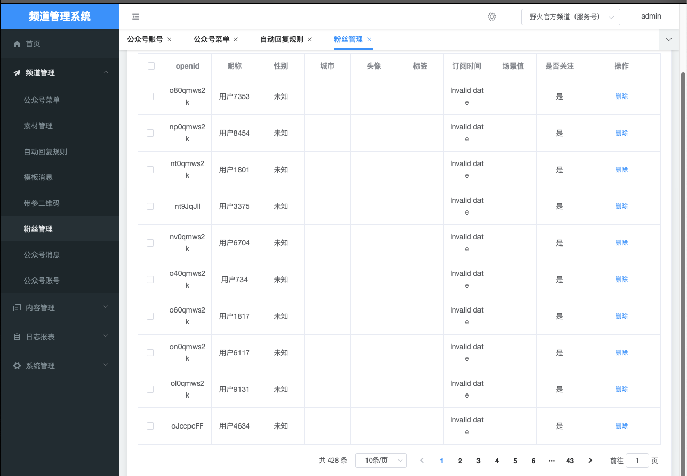
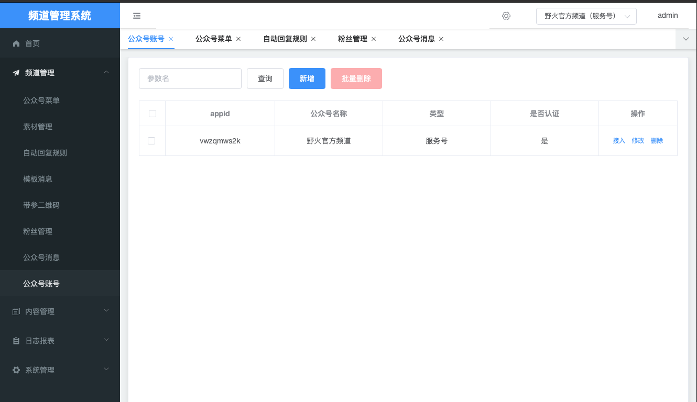
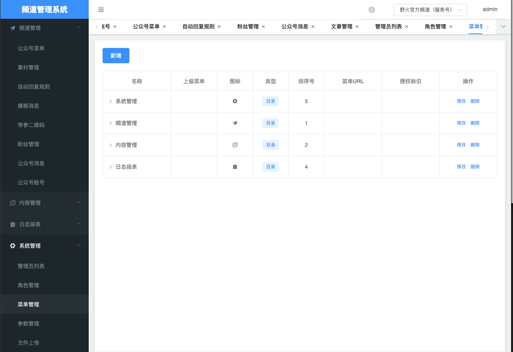

# 野火频道服务
野火频道管理系统，支持多频道接入。提供频道菜单、自动回复、发布文章、CMS等管理功能。使用前需要部署野火IM服务。

## 野火频道系统
野火频道系统包括3部分。[server](./server)为野火频道服务的后端服务，给管理后台页面和客户端页面提供服务；[manage](./manage)为野火频道管理页面，管理员可以登录并管理频道；[client](./client)为客户端页面，在用户手机展示文章内容。

## 依赖
依赖Java1.8

## 编译manage
编译机器上按照nodejs，进入到[manage](./manage)目录，执行下述命令
```
npm install
npm run build
```

## 编译client
编译机器上按照nodejs，进入到[client](./client)目录，执行下述命令
```
npm install
npm run build
```

*** 注意，要先编译```manage```再编译```client```，因为前端页面编译后会拷贝到后端的static目录，后编译```manage```会覆盖所有的资源。 ***

## 编译后端
进入到[server](./server)目录，执行下述命令
```shell
mvn clean package
```
生产软件包```channel-server-0.1.0.jar```在```target```目录下。

## 配置
默认使用h2db，可以不用修改配置直接运行。如果要是想使用mysql，需要修改 ```server/config/application-{dev|prod}.yml```文件，按照说明配置。

## 运行
服务器安装有jdk1.8。把```server/config```目录拷贝到```channel-server-0.1.0.jar```同目录，然后执行下面语句：
```shell
java -jar channel-server-0.1.0.jar
```

## 登录
当运行成功无报错后，使用浏览器打开```http://${ip地址}:8088```。使用用户名密码 ```admin/123456``` 来进行登录，登录后可以修改管理员密码和添加更多管理员。

## 对接野火IM服务
1. 通过[开发平台](https://github.com/wildfirechat/open-platform)创建频道
2. 在管理页面（频道管理 - 公众号管理）添加频道，填入IM服务地址（端口是80），上一步所创建的频道ID和频道密钥。

## 测试
测试菜单，自动回复，文章等功能。

## 前后端分离
默认编译```client```和```manage```会把前端页面放到```server```的```static```目录。也可以前后端分离部署，把前端页面单独部署。

## 截图
菜单


自动回复


私聊


粉丝管理


文章管理


频道账户


系统管理


## 项目来源
项目Base于[wx-api](https://github.com/niefy/wx-api)。
